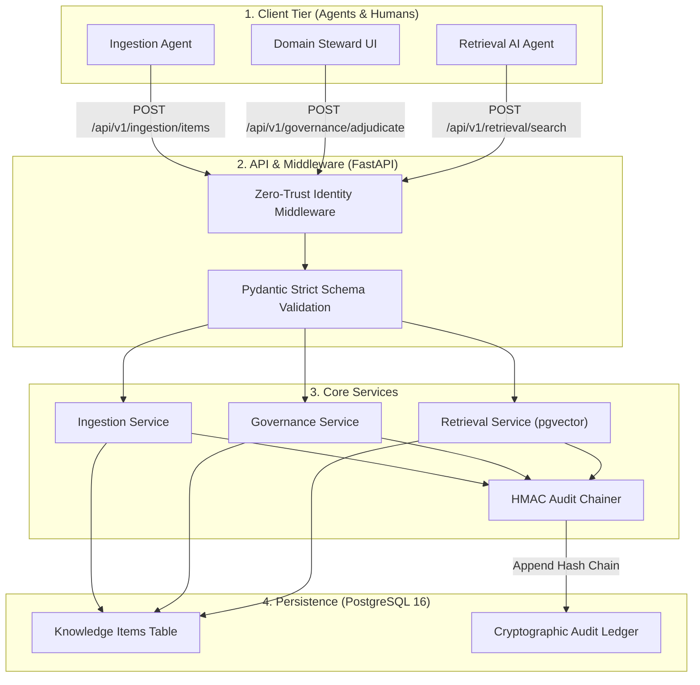

---

[](https://www.python.org/downloads/)
[](https://fastapi.tiangolo.com/)
[](https://www.postgresql.org/)
[](https://github.com/pgvector/pgvector)
[](https://www.docker.com/)
[](tests/)

> **An enterprise-grade, cryptographically audited, and role-scoped organizational knowledge repository. Designed to serve as the single, authoritative memory layer for autonomous AI agents and human personnel with a strict zero-trust governance tollgate.**

---

## 📋 Table of Contents
1. [Executive Summary](#1-executive-summary)
2. [Problem Statement & Business Motivation](#2-problem-statement-and-business-motivation)
3. [Key Features](#3-key-features)
4. [System Architecture](#4-system-architecture)
5. [Technology Stack](#5-technology-stack)
6. [Installation & Environment Setup](#6-installation--environment-setup)
7. [Quick Start & Demo Instructions](#7-quick-start--demo-instructions)
8. [Governance & Cryptographic Audit Ledger](#8-governance--cryptographic-audit-ledger)
9. [Documentation Reference](#9-documentation-reference)

---

## 1. Executive Summary
In modern enterprise AI deployments, autonomous agents and human workers require rapid access to cross-departmental institutional knowledge. However, exposing enterprise knowledge directly to AI agents or general search interfaces creates catastrophic operational and legal vulnerabilities. 

This repository implements the **Flourish Governed Memory Hub Prototype** (Ref: `AA-FLR-HUB-2026-001`, Prepared by Binod Kumar), which:
1. **Establishes a Governance Tollgate:** Quarantines ingested documents (`PENDING`) until explicitly validated and adjudicated (`APPROVED`) by an authorized Domain Steward.
2. **Enforces Role-Scoped Retrieval:** Implements Least Privilege by Construction. Queries execute within namespaced and role-scoped SQL execution boundaries, physically eliminating data leakage for unapproved or unauthorized items.
3. **Implements Cryptographic Tamper-Evidence:** Records every state change, ingestion event, and retrieval attempt in an HMAC-SHA256 hash-chained audit log, ensuring absolute tamper-evidence.

---

## 2. Problem Statement and Business Motivation

### 🏢 The Business Risk
An organization deploying AI agents across proprietary data faces two competing pressures:
* **Speed & Autonomy:** Agents must instantly retrieve context to generate code, answer questions, and execute operational workflows.
* **Security & Compliance:** If an AI agent retrieves unverified, outdated, or unauthorized sensitive documents (e.g., `M&A Target Valuations`), it generates harmful hallucinations and leaks data horizontally.

### ⚠️ The Technical Problem
Traditional search engines and vector databases perform post-query filtering. If an index returns a document title or snippet before applying access control checks, sensitive information leaks to unauthorized actors. Furthermore, without a cryptographic ledger, organizations lack the forensic capability to prove *what* knowledge the agent accessed and *who* approved it.

---

## 3. Key Features
* **🚫 Zero Leakage Guarantee:** 100% of automated tests confirm that no `PENDING`, `REJECTED`, or out-of-role item is ever returned.
* **🔒 Cryptographic Immutability:** Append-only HMAC-SHA256 hash-chained audit ledger that detects historical row tampering in $O(N)$ sequential time.
* **⚖️ Four-Eyes Governance:** Strict separation of duties preventing an author from approving their own ingested knowledge item.
* **🧠 Unified Vector & Relational Storage:** PostgreSQL 16 with `pgvector` handles both high-performance HNSW vector retrieval and transactional state machines without split-brain sync issues.
* **⚡ Zero-Trust Identity:** Raw HTTP headers are resolved into an immutable `CallerContext`, injecting role-based access directly into SQL `WHERE` clauses prior to execution.

---

## 4. System Architecture
The system uses a highly cohesive, modular monolithic design capable of deterministic transactional integrity (`Section 15` fail-closed transactions):



---

## 5. Technology Stack
* **Language:** Python 3.11
* **Framework:** FastAPI / Uvicorn (ASGI)
* **Database:** PostgreSQL 16 + pgvector
* **ORM:** SQLAlchemy 2.0 (Async)
* **Validation:** Pydantic v2
* **Migrations:** Alembic
* **Orchestration:** Docker Compose

---

## 6. Installation & Environment Setup
The system is fully containerized and executes deterministically. It requires **0 manual database seeding steps**.

```bash
# 1. Clone the repository
git clone <repository_url>
cd Flourish_Memory_Hub

# 2. Boot the PostgreSQL database and FastAPI backend
docker compose up --build -d

# 3. Verify system health
curl -f http://localhost:8000/api/v1/status/overview
```

To run the test suite locally using a standard Python virtual environment:
```bash
python -m venv .venv
source .venv/bin/activate  # (or .venv\Scripts\activate on Windows)
pip install -e .
pytest tests/ -v
```

---

## 7. Quick Start & Demo Instructions
The repository includes a comprehensive, multi-persona demo script that simulates the entire lifecycle of a document in an interactive CLI. 

```bash
# Execute the automated multi-persona workflow
python scripts/demo_flow.py
```
*(Note: Use `python scripts/demo_flow.py --local-test` if you are executing against the ASGI in-memory transport without Docker running).*

### 💻 Verbatim CLI Demo Transcript
```text
Flourish Memory Hub - Interactive Demo Flow

--- STEP 1: ENGINEER INGESTS DOCUMENT ---
POST /api/v1/ingestion/items
Success! Item ID: a5c68325-17c8-4342-bc72-25832012bc6a | Status: PENDING

--- STEP 2: ENGINEER ATTEMPTS SEARCH (PENDING) ---
POST /api/v1/retrieval/search
Item found in search? False (Expected: False because it is PENDING)

--- STEP 3: STEWARD APPROVES DOCUMENT ---
POST /api/v1/governance/adjudicate/a5c68325-17c8-4342-bc72-25832012bc6a
Success! New Status: APPROVED

--- STEP 4: ENGINEER GENERATES LLM CONTEXT ---
POST /api/v1/context/assemble
Success! Generated XML Prompt Length: 579 chars
Manifest contains 2 citations.

--- STEP 5: ADMIN VERIFIES CRYPTOGRAPHIC LEDGER ---
GET /api/v1/audit/verify
Success! Compromised: False | Verified Records: 5

*** DEMO WORKFLOW COMPLETED SUCCESSFULLY ***
```

---

## 8. Governance & Cryptographic Audit Ledger
To ensure forensic accountability, the `audit_logs` table forms the backbone of the memory hub:
* **Cryptographic Immutability (Option A):** Rather than relying solely on database-level role restrictions which can be bypassed by a compromised DBA, this prototype implements cryptographic append-only guarantees. 
* **HMAC Chaining:** Every log row mathematically seals the previous row's signature combined with the current payload using a secret runtime HMAC key (`prev_hash`). Any `UPDATE` or `DELETE` to historical rows breaks the chain and triggers an immediate compromise alert via `/api/v1/audit/verify`.

---

## 9. Documentation Reference
For exhaustive architectural specifications, refer to the following project deliverables:
* [Technical Blueprint](technical-bluprint.md): The single-source-of-truth enterprise architecture specification.
* [Design Notes](DesignNotes.md): A concise summary of the specific engineering tradeoffs, security boundaries, and architectural patterns implemented in this prototype.
